# Certis

**A personal finance workspace that turns everyday transactions into a clear picture of where your money goes, what is coming next, and what you are working toward.**

Certis brings accounts, transactions, budgets, categories, recurring payments, savings goals, and financial analytics into one place. Instead of maintaining several spreadsheets or trying to reconstruct the month from separate bank accounts, you get one consistent view of your finances and the tools to plan ahead.

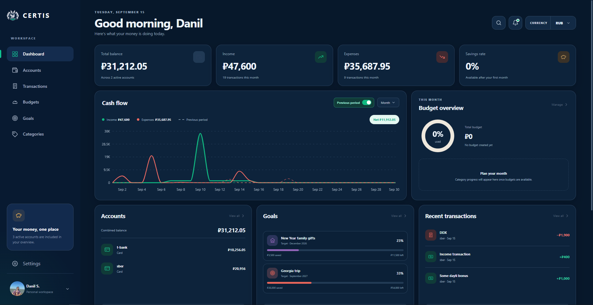

## Why Certis?

Managing personal finances is rarely difficult because the numbers are complicated. It is difficult because the information is fragmented: money is spread across several accounts, recurring payments are easy to forget, categories become inconsistent, and long-term goals live separately from day-to-day spending.

Certis is designed to connect those pieces.

- **See the whole picture.** Keep multiple accounts, balances, income, expenses, transfers, and recent activity in one workspace.
- **Understand your spending.** Categories, monthly breakdowns, trends, and visual analytics make it easier to see where money actually goes.
- **Plan before money is spent.** Monthly budgets and recurring transactions help make future commitments visible instead of treating them as surprises.
- **Turn goals into a plan.** Track savings goals, contributions, progress, and the monthly amount needed to reach a target.
- **Keep the workflow simple.** Fast transaction entry, quick category assignment, filtering, and reusable recurring rules reduce routine work.
- **Use the app your way.** Certis supports light and dark themes, English and Russian interfaces, and multiple currencies.

## Your finances at a glance

The dashboard is the starting point of Certis. It combines the information that is usually scattered across several screens: monthly income and expenses, recent transactions, account balances, cash flow, goals, and category analytics.

The goal is not to show more numbers. It is to make the important ones visible without having to build a report first.


### Understand not only how much you spent, but where it went

Category analytics turn transaction history into something useful for decision-making. Certis shows spending distribution and how category spending changes over time, helping you distinguish one-off purchases from recurring patterns.

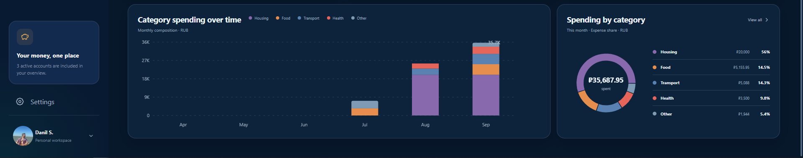

## Track everyday money movement

Certis keeps income, expenses, and transfers in a single transaction workflow. Transactions can be filtered and reviewed over time, while account and category context keeps the history understandable after the fact.

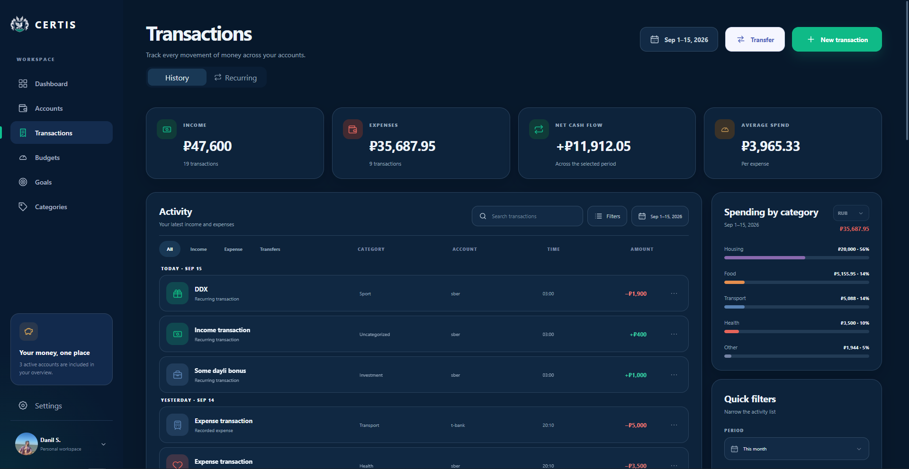

Adding a transaction is intentionally lightweight: choose the type, account, amount, date, category, and optional details without leaving the current workflow.

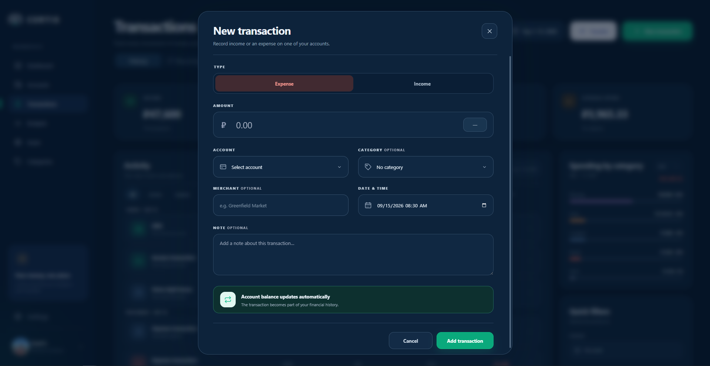

## Put recurring payments on autopilot

Subscriptions, rent, salary, loan payments, and other repeating operations should not have to be entered manually every month.

Recurring transactions let you define a schedule once and keep upcoming financial activity visible. You can review active rules, pause or edit them, and see what is scheduled next.

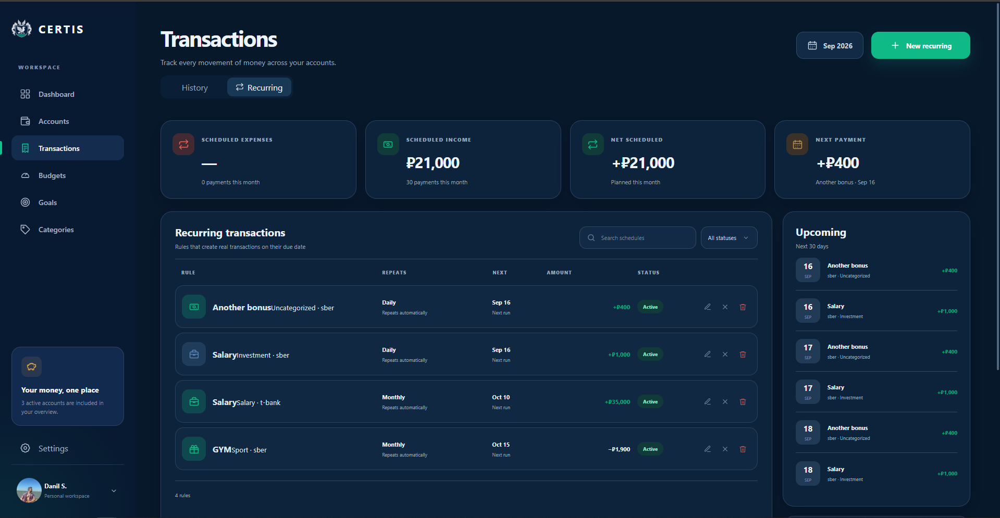

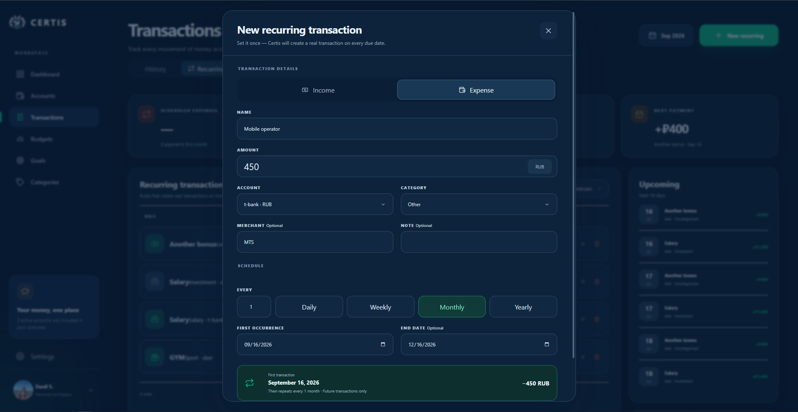

## Make categories work for you

Categories are more than labels in Certis. They are the basis for spending analysis, budget planning, and a cleaner transaction history.

You can create your own income and expense categories, customize them visually, archive categories you no longer need, and review monthly category performance.

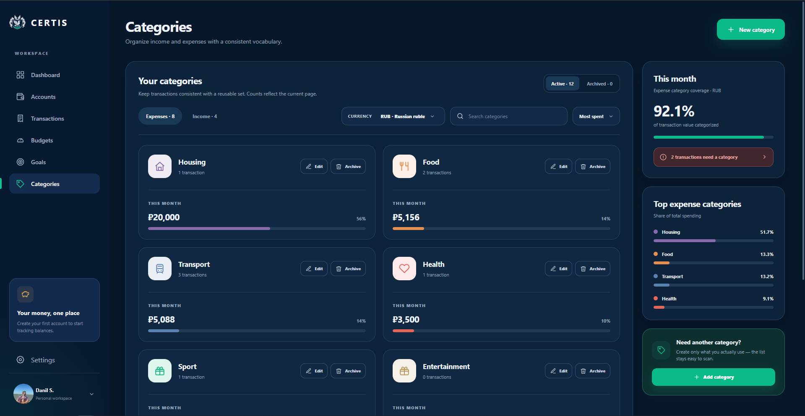

When transactions are missing a category, Certis provides a dedicated quick-assignment flow so you can clean up several records without opening them one by one.

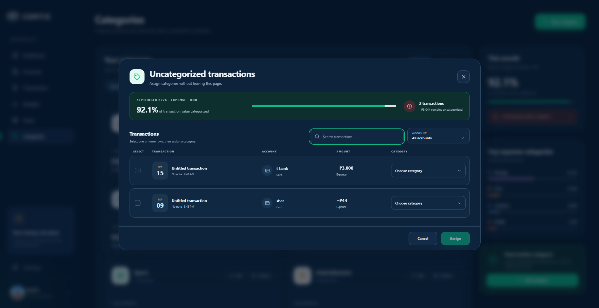

Custom categories can be created directly from the app with their own name, type, icon, and visual identity.

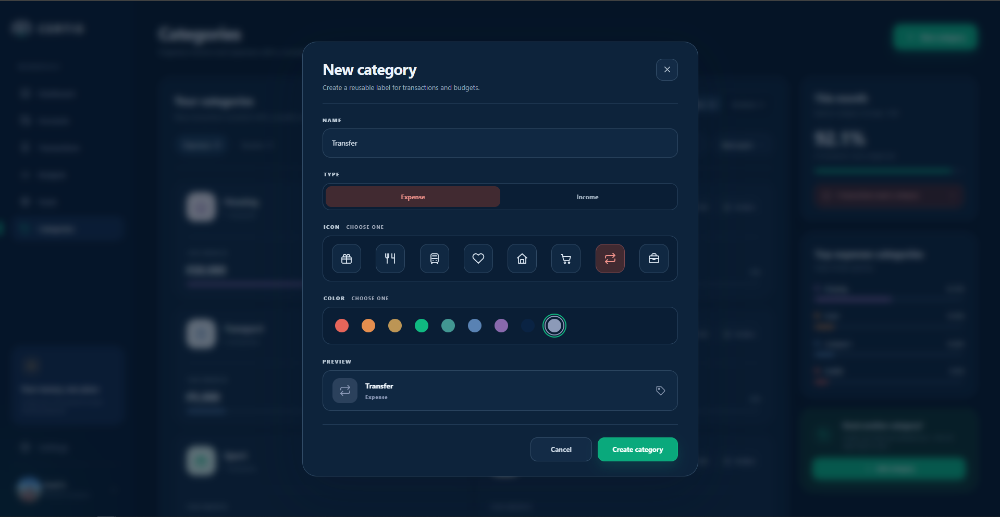

## Plan monthly spending with budgets

Tracking past expenses is useful, but it only explains what already happened. Certis also includes monthly budgets so spending can be planned before the month is over.

Budgets let you allocate money across categories and compare planned limits with actual spending. Together with category analytics, this creates a feedback loop: **plan → spend → review → adjust**.

## Save toward real goals

Certis treats savings goals as part of the same financial system as accounts and transactions rather than a separate checklist.

Create a target, set the amount and desired completion period, track contributions, and follow progress over time. Certis can also calculate a recommended monthly contribution so a large target becomes a concrete monthly plan.

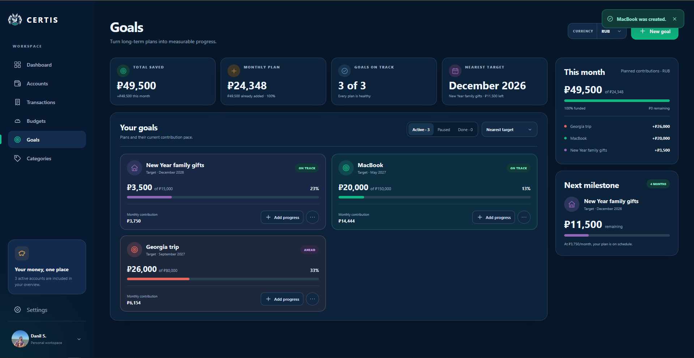

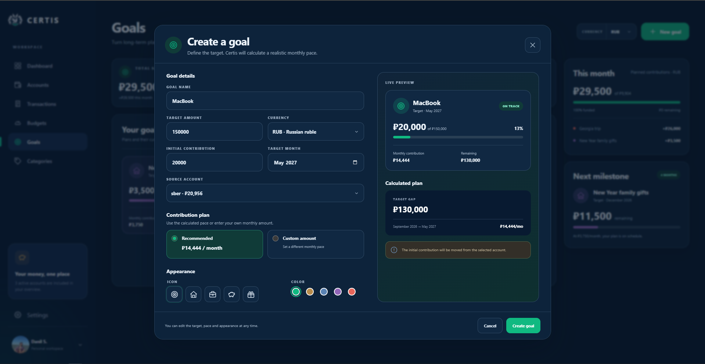

## Manage multiple accounts without losing context

Cash, bank accounts, and cards can be managed separately while still contributing to a single view of your finances. Transfers move money between accounts without pretending that the movement itself is income or spending.

Creating an account takes only the information needed to make it useful in the rest of the product.

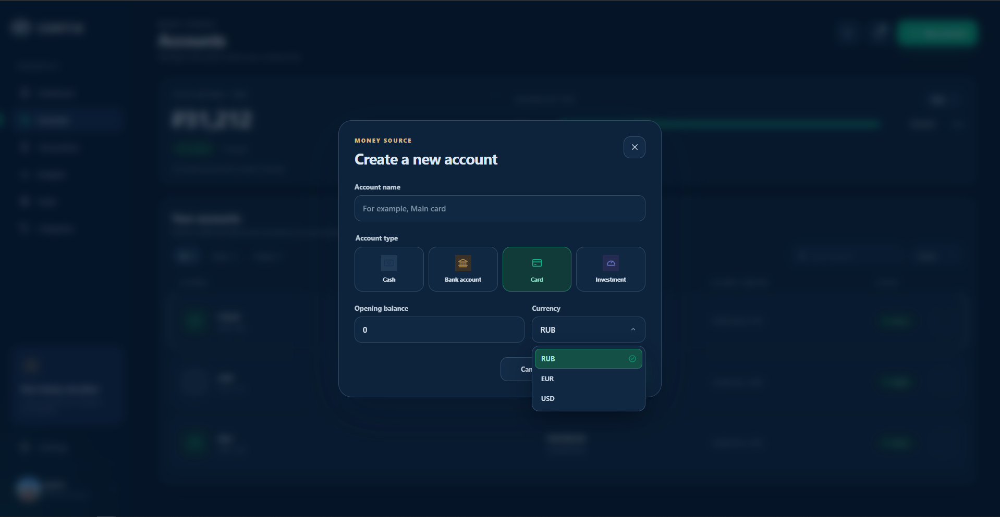

## Built around your preferences

Certis supports both **light and dark themes** and can switch between **English and Russian** without changing the underlying financial data.

<p align="center">
  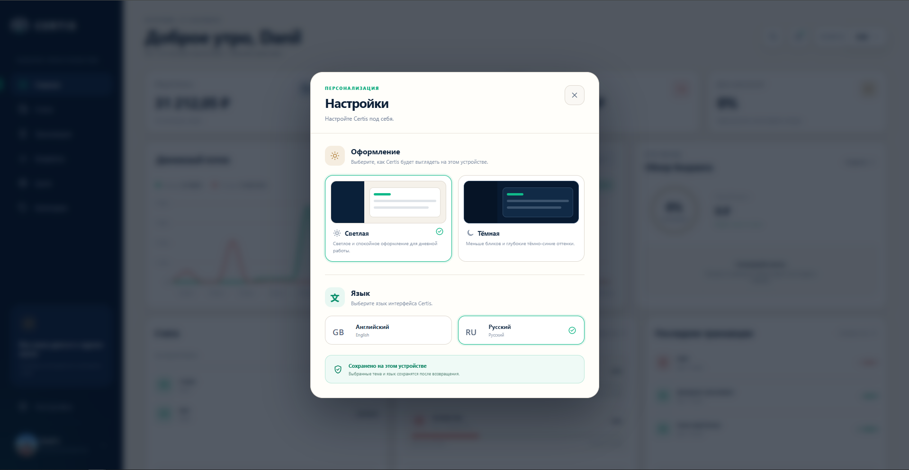
  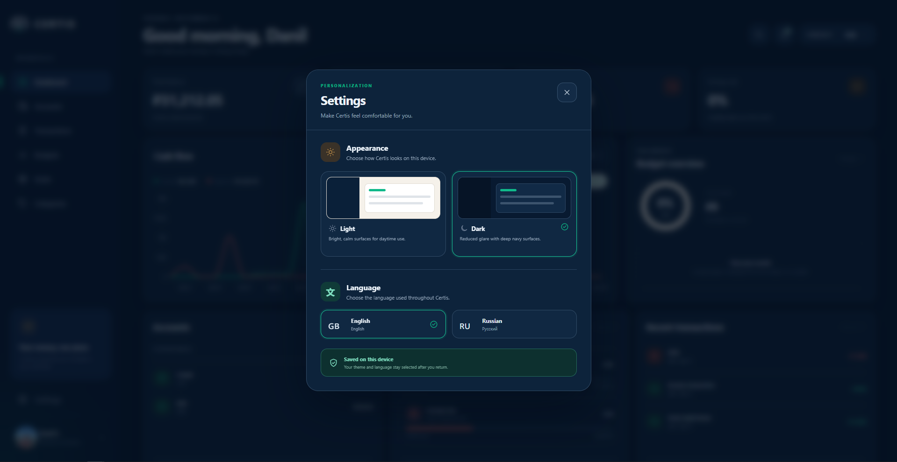
</p>

Profile settings keep personal preferences such as the default currency close to the rest of the application.

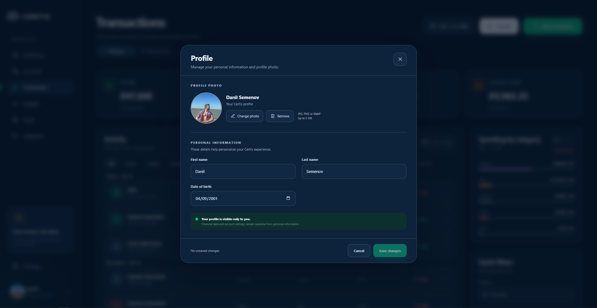

## What Certis covers today

| Area | What you can do |
| --- | --- |
| **Dashboard** | Review income, expenses, cash flow, recent transactions, accounts, goals, and category analytics |
| **Accounts** | Maintain multiple accounts and balances, create accounts, and transfer money between them |
| **Transactions** | Record income and expenses, filter history, edit records, and create transfers |
| **Recurring transactions** | Schedule repeating income or expenses and manage upcoming activity |
| **Categories** | Create custom categories, archive/restore them, analyze monthly spending, and quickly categorize missed transactions |
| **Budgets** | Create monthly budgets and allocate planned spending across categories |
| **Goals** | Create savings goals, track contributions and progress, and calculate recommended monthly contributions |
| **Personalization** | Switch between light/dark themes, English/Russian UI, and supported currencies |

## Product experience

Certis is built for people who want more control than a simple balance widget provides, but do not want personal finance management to become another spreadsheet project.

The product is centered around three ideas:

1. **Visibility** — the current financial picture should be understandable at a glance.
2. **Consistency** — accounts, transactions, categories, budgets, and goals should use the same financial context instead of living in isolated tools.
3. **Planning** — the application should help with the next month and the next goal, not only summarize the past.

The public landing and authentication experience are part of the same product rather than separate prototypes.

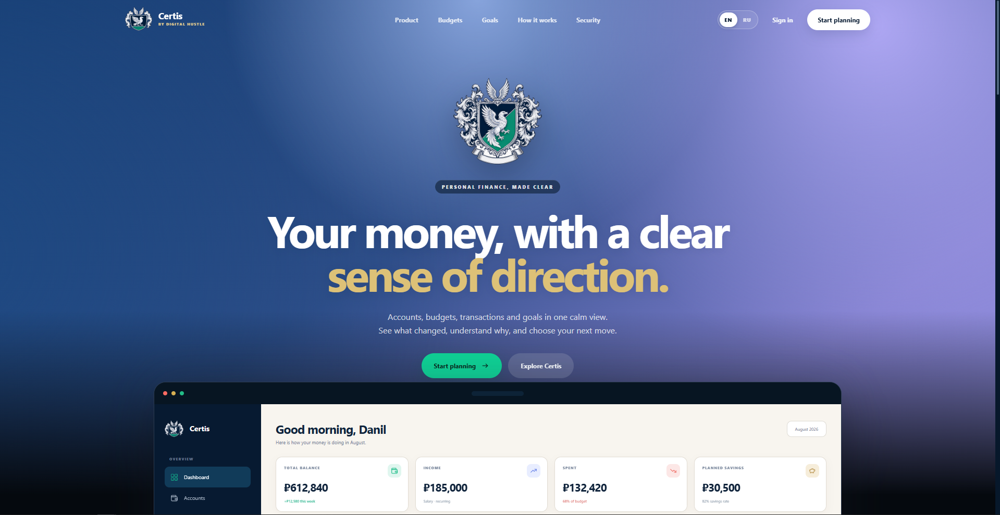

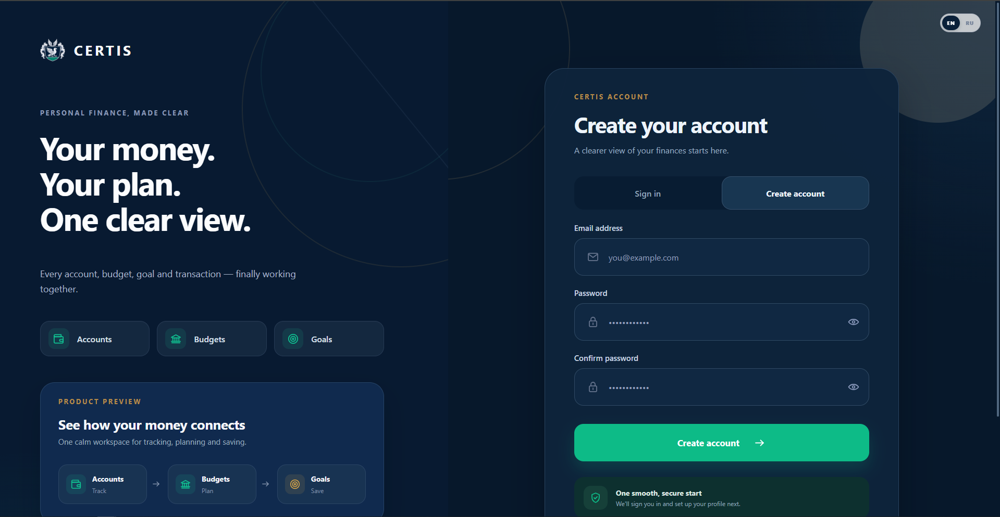

---

## Technical overview

Certis Web is the frontend of the Certis platform. The backend is maintained separately in [`certis-api`](https://github.com/DanyaChetvyrtov/certis-api).

The frontend uses a feature-oriented React architecture and communicates with the API over HTTP. Authentication is cookie-based, so access and refresh tokens remain browser-managed rather than being stored in JavaScript-accessible storage.

### Stack

| Area | Technology |
| --- | --- |
| UI | React 19 |
| Language | TypeScript 6 |
| Build | Vite 8 |
| Routing | React Router 7 |
| Charts | Recharts 3 |
| Localization | i18next + react-i18next |
| UI primitives | Radix UI |
| Testing | Vitest, Testing Library, MSW |
| Static analysis | ESLint |
| Production runtime | Nginx 1.28 Alpine |
| CI/CD | GitHub Actions + Docker |

### Local development

Requirements:

- Node.js **24+**
- npm
- [`certis-api`](https://github.com/DanyaChetvyrtov/certis-api) running on `http://localhost:8080`

```bash
git clone https://github.com/DanyaChetvyrtov/certis-web.git
cd certis-web
npm ci
npm run dev
```

The application is available at `http://localhost:3000`. During development, Vite proxies `/api` requests to `http://localhost:8080`.

Optional environment configuration:

```dotenv
# Leave empty for the local Vite proxy or same-origin deployment.
VITE_API_URL=
```

### Development commands

```bash
npm run dev        # Start the development server
npm run lint       # Run ESLint
npm test           # Run the Vitest suite
npm run test:watch # Run tests in watch mode
npm run build      # Type-check and build for production
npm run preview    # Preview the production build
```

Before opening a pull request:

```bash
npm run lint
npm test
npm run build
```

### Project structure

```text
src/
├── app/            # Routing and route guards
├── components/     # Reusable cross-feature UI
├── features/       # Product feature modules
│   ├── accounts/
│   ├── auth/
│   ├── budgets/
│   ├── categories/
│   ├── dashboard/
│   ├── goals/
│   ├── landing/
│   ├── profile/
│   ├── settings/
│   └── transactions/
├── i18n/           # Localization
├── layouts/        # Shared layouts
├── pages/          # Application-level page composition
├── shared/         # Shared API client, hooks, and utilities
└── test/           # Shared test setup
```

### CI and Docker

Pull requests targeting `main` run linting, Vitest tests, the production build, and Docker image validation when relevant files change.

The production image uses a multi-stage Node.js + Nginx build. Nginx serves the SPA, provides history fallback and asset caching, exposes `/health`, and proxies `/api/` to the backend service.

```bash
docker build -t certis-web .
docker run --rm -p 8080:8080 certis-web
```

The production container expects the backend service to be reachable as `api:8080`.

## Related repository

- [`certis-api`](https://github.com/DanyaChetvyrtov/certis-api) — Kotlin + Spring Boot backend for Certis.
